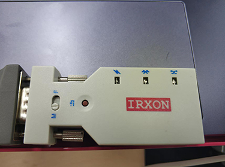
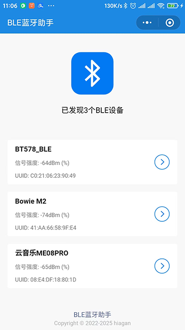
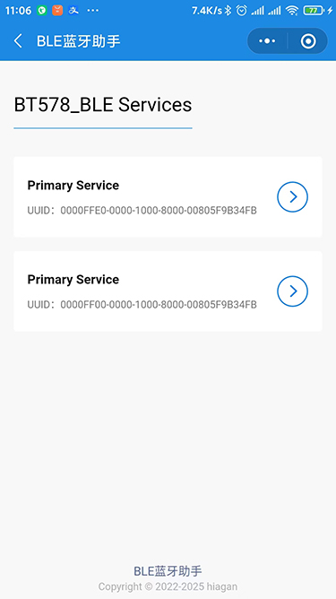
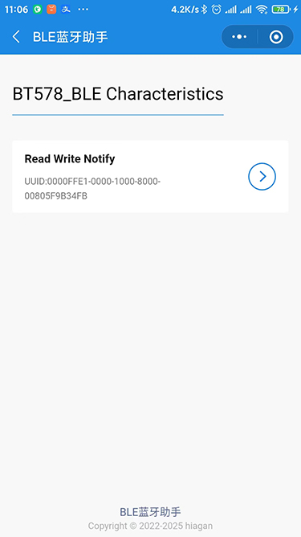
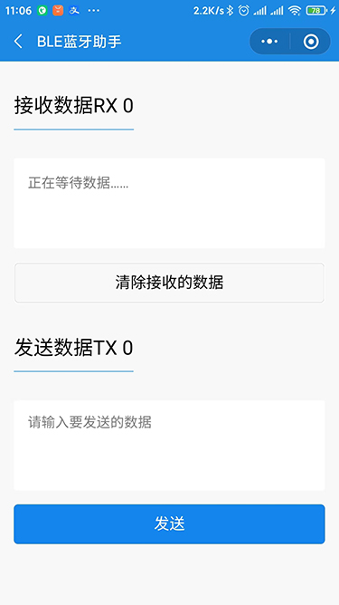
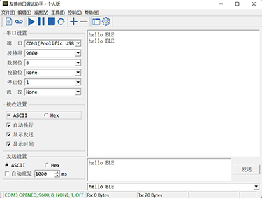
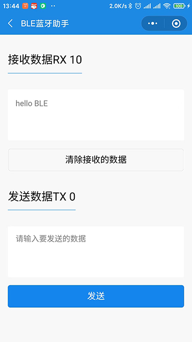

# 小程序BLE蓝牙助手

## 简介
小程序BLE蓝牙助手是一款蓝牙BLE调试工具，支持蓝牙BLE设备发现、服务发现、特征获取，数据读写等功能。 

## 使用说明
1、utils目录下的sdBLE.js是项目的核心库文件，蓝牙BLE的操作都在这个库文件中
2、search目录的功能是发现蓝牙BLE设备，过滤掉了名字为 N/A的设备
3、service目录的功能服务发现，展示蓝牙的全部服务列表
4、characteristic目录的功能是蓝牙特征获取
5、com目录的功能是数据读取和发送

## 演示
1、打开蓝牙BLE设备，如下图在某宝上买了一个BLE设备

2、打开手机蓝牙，同时打开小程序BLE蓝牙助手，如下图，BLE蓝牙助手会自动发现设备，如果没有发现，下拉刷新即可发现，这里的设备名字叫BT578

3、点BT578，会列出BT578的服务列表，如下图

4、点服务列表，会列出蓝牙特征值

5、最后可以能过特征值进行数据读写

6、打开串口软件测试数据读写

7、小程序收到数据

